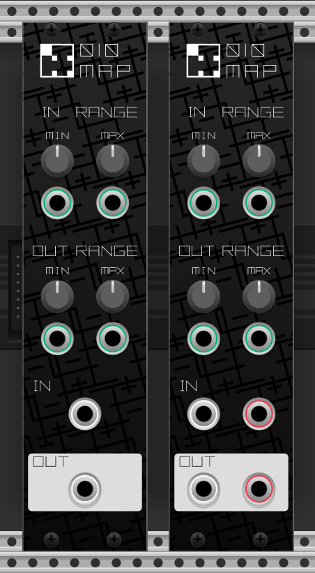

# 010Map

A module providing functionality similar to [Processing's map()](https://processing.org/reference/map_.html)  function.

## Usage

* IN RANGE MIN: Lower limit of input value range
* IN RANGE MAX: Upper limit of input value range
* OUT RANGE MIN: Lower limit of conversion range
* OUT RANGE MAX: Upper limit of conversion range

## License

This project is licensed under the MIT License, see the LICENSE.txt file for details.  
(Distributed under the MIT License in accordance with the [VCV Rack Non-Commercial Plugin License Exception](https://github.com/VCVRack/Rack/blob/v1/LICENSE.md).)  
The SVGs used (in res) are distributed under the Creative Commons CC-BY-NC-SA-4.0 and are copyright tech7nica.  
